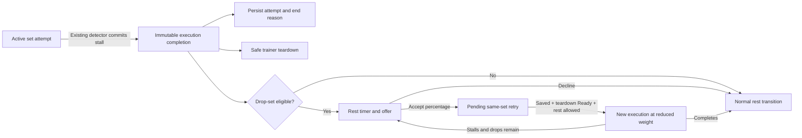

# Issue #673: User-Prompted Drop-Set Retry After Stall Failure

**Date:** 2026-08-13
**Status:** Approved design
**Issue:** https://github.com/9thLevelSoftware/Project-Phoenix-MP/issues/673
**Existing PR to revise:** https://github.com/9thLevelSoftware/Project-Phoenix-MP/pull/686
**Prerequisite:** Issue #687 workout execution isolation must merge first

## Summary

When an eligible Old School working set ends through Phoenix's existing stall detector, save that failed attempt and show an inline offer on the rest screen. The user may decline or choose a 10%, 20%, or 30% reduction. Accepting the offer creates a new trainer execution for the same planned set after the previous execution has fully torn down. Remaining sets of that routine-exercise occurrence inherit the final cumulative multiplier; the next exercise returns to its original programming. The saved routine is never mutated.

The redesign preserves the hardware-compatible pivot already accepted in the issue thread but revises the implementation sequence:

1. Repair PR #686 as a reliable set-completion-reason foundation.
2. Replace the proposed stall-detector rewrite with a deterministic drop-set engine and recovery foundation.
3. Add routine configuration, the approved rest-screen experience, sync/backup integration, and end-to-end validation.

Stall detection remains unchanged. Real hardware is used to validate command ordering and the completed experience, not to tune or replace the detector.

## History and evidence

### The original implementation is superseded

The first implementation, PR #682, automatically treated `DELOAD_OCCURRED` as a weight-reduction trigger and applied a lower weight to a later set. It was closed without merging and explicitly superseded. That approach had two fundamental problems:

- The trainer cannot safely accept a full workout configuration while a set is active. The current engine documents that an active-set configuration resets or faults the exercise and defers weight changes to a safe set boundary in `ActiveSessionEngine.kt`.
- Applying a reduction to the next programmed set is inter-set autoregression, not a drop-set retry of the failed set.

PR #682 also accumulated state-boundary defects involving lost pending weight, leakage into later exercises, autoplay/manual-summary gaps, and incorrect persisted weights. Its runtime logic must not be cherry-picked or restored.

The replacement issue flow correctly moved the decision to rest and re-enters the same planned set after a complete stop/start boundary. The maintainer accepted the final native in-app rest-screen prototype with the expectation of normal Phoenix theme and accessibility polish.

### PR #686 is directionally correct but not merge-ready

PR #686 correctly begins the replacement design by introducing set-end reasons and persistence. It should be repaired rather than discarded, preserving its review history. It currently requires the following changes:

- Rebase after issue #687 lands and resolve against current `main`.
- Replace coordinator-global mutable `lastSetEndReason` / `autoStopReason` state with an immutable, execution-bound completion record.
- Remove the default completion reason so every terminal call site must classify itself explicitly.
- Migrate historical and unclassified data to `UNKNOWN`, not `TARGET_REPS_REACHED`.
- Preserve the reason through delayed completion paths such as bodyweight confirmation and late Just Lift tagging.
- Correct the schema test: a migration file named `43.sqm` migrates schema 43 to 44, while the failing test currently exercises 42 to 43.
- Remove the global 100 kg validation cap. Phoenix intentionally supports Trainer+ loads through 110 kg, and the relevant activation fields are 32-bit floats. A hardware-aware protocol limit can be investigated separately.
- Remove unrelated offset renaming and protocol cleanup from this feature unless independently proven and reviewed.
- Add lifecycle tests that prove the reason emitted by every completion path and prove that a stale execution cannot supply a reason to a later one.

### The proposed detector PR is based on stale assumptions

The issue's proposed second PR says the geometric ROM-fraction detector is needed to close audit finding F5. The audit's later corrections record that F5 was already resolved by the completed-rep cancellation and per-sample position recheck changes. Replacing the detector would add a new, hardware-sensitive algorithm without a remaining feature prerequisite or reference implementation.

This design consumes the existing terminal stall decision exactly where the current engine commits to ending the set. Raw `DELOAD_WARN`, `DELOAD_OCCURRED`, position, or velocity samples do not independently create a drop-set offer.

### Process-death persistence needs a durable runtime record

`WorkoutServiceSnapshot` only feeds foreground-service presentation and is not recovery storage. A `workout_overlay` JSON field on a completed `WorkoutSession` would instead mix transient orchestration state into historical data. The selected design uses a small local-only active-runtime table with versioned JSON.

### Planned-set identity needs a non-null runtime key

`CompletedSet.plannedSetId` is nullable, and production code only looks up an existing `PlannedSet`; it does not guarantee that one exists for every routine set. The feature therefore cannot use `plannedSetId` as its sole replay, retry-budget, or history-grouping key. It uses a required composite `LogicalSetKey` derived from routine session, routine-exercise occurrence, working-set index, and set kind. A non-null `plannedSetId` remains useful metadata and is validated when present.

### Repository process note

The root `AGENTS.md` directs planning changes to `openspec/AGENTS.md`, but that file and directory are absent from this worktree. This document therefore follows the repository's existing `docs/superpowers/specs` convention. If OpenSpec is restored before implementation, the approved design must be mirrored into its required proposal format without changing the decisions here.

## Goals

- Offer an explicit drop-set retry only after a confirmed Old School stall failure.
- Save every failed and retried execution accurately in workout history.
- Retry the identical planned set without disturbing routine or superset advancement.
- Apply a cumulative, exercise-scoped multiplier to the retry and remaining sets of that routine-exercise occurrence.
- Keep all trainer commands behind a safe teardown/start boundary.
- Preserve pending decisions, attempts, and load overlays across process death.
- Keep existing routines and all non-eligible workout modes behaviorally unchanged.
- Deliver the work as three sequential, reviewable PRs.

## Non-goals

- Changing or tuning stall detection.
- Sending a configuration or force adjustment while a set is active.
- Using negative per-rep progression as a drop-set mechanism.
- Automatically reducing weight without a user decision.
- Supporting Echo, Just Lift, bodyweight, warm-up, or non-Old-School drop-set offers in v1.
- Mutating the saved routine or its programmed set weights.
- Introducing a separate generated parent/chain identifier when the composite logical-set key plus attempt number is sufficient.
- Enforcing an unverified 100 kg device-independent limit.

## Alternatives considered

### Selected: repair PR #686 and preserve three delivery slices

Repair PR #686 after #687, use PR 2 for the deterministic engine and recovery model, and use PR 3 for configuration and UI integration. This retains review continuity, keeps schema and state-machine changes reviewable, and removes speculative detector work.

### Rejected: replace PR #686 with a clean PR

A clean replacement would produce a tidier diff but lose useful review history and create another abandoned branch. PR #686 contains salvageable schema, repository, and backup work.

### Rejected: repair PR #686 and implement the feature in one large PR

This would combine migrations, completion classification, routine navigation, weight resolution, runtime recovery, sync, backup, and Compose UI in one review. PR #682 demonstrated that these state boundaries need isolated tests and reviews.

### Rejected: retain the issue's geometric detector PR

The cited audit gap is already closed, and the proposed thresholds have no validated reference implementation. Detector experimentation may be proposed separately if future hardware evidence identifies a concrete remaining defect.

## Dependency on issue #687

This feature must be based on the approved [issue #687 execution-isolation design](2026-08-13-issue-687-workout-execution-isolation-design.md) and its implementation.

Each initial attempt and each drop-set retry is a distinct execution lease. Completion, persistence, rest transitions, and retry actions carry that lease or an immutable snapshot derived from it. A retry cannot start until the connection-wide teardown barrier is `Ready`. Reset failure or timeout remains fail-closed through #687's recovery path.

PR #686 must not be rebased and repaired against pre-#687 completion globals and then merged ahead of the execution boundary.

## Product contract

### Eligibility

An offer is created only when all of the following are true:

- The existing detector ended the execution with `STALL_FAILURE`.
- The failed execution is an Old School cable working set.
- Drop-set prompting is enabled on that routine-exercise occurrence.
- The execution is not Echo, Just Lift, bodyweight, or a warm-up.
- The planned set has accepted fewer than two drops.
- The captured routine, routine-exercise occurrence, logical-set key, optional planned-set identity, and coordinates still match the live routine.
- At least one percentage choice resolves to a valid weight lower than the failed attempt without crossing the configured floor.

Eligibility is a pure policy over an immutable completion record and configuration. A reason alone is not sufficient.

### User-visible behavior

1. The failed execution captures its immutable result, starts teardown, and starts durable persistence.
2. The normal rest screen appears with its timer running without waiting for teardown or persistence to finish.
3. An inline card asks, “Retry this set with a drop set?” and displays 10%, 20%, and 30% choices with exact weight previews.
4. The user either declines or selects a percentage and accepts the retry.
5. The rest timer continues during the decision. Autoplay cannot leave the rest screen while the offer is unresolved.
6. An accepted retry starts only when the rest transition is allowed, the failed attempt is durably saved, and the trainer teardown barrier is `Ready`.
7. The retry receives a new execution and session ID but retains the same logical-set key, optional planned-set ID, and `(exerciseIndex, setIndex)`.
8. Normal advancement runs once after the final attempt. In a superset, A1 failure → retry A1 → B1.
9. The exercise multiplier applies to the remaining programmed sets of A. B and all later exercises retain their own programming.

### Retry and decline semantics

- No percentage is preselected. “Retry set” is disabled until a valid choice is selected.
- Accepting replaces the pending rest transition with a same-set retry; it does not send a trainer command immediately.
- “Skip drop set” declines only the offer. It does not skip the remaining rest time.
- The existing “Skip Rest” action is disabled while the offer is unresolved. After resolution, it executes the selected normal or retry transition.
- If autoplay reaches zero with an unresolved offer, the timer remains at zero and the screen visibly waits for the user's decision.
- If the user accepts after the timer has reached zero, the retry may proceed immediately once persistence and teardown gates are satisfied.

## Runtime architecture



### Immutable completion

Introduce an immutable completion value, represented here as `SetExecutionCompletion`, containing at least:

- execution ID and stable session ID from #687;
- originating profile and routine-session IDs;
- routine ID and routine-exercise occurrence ID;
- required logical-set key, optional planned-set ID, and captured exercise/set coordinates;
- explicit `SetEndReason`;
- attempt number and accepted-drop count;
- planned set type and mode flags;
- programmed base weight, configured attempt weight, and progression;
- rep counts and the existing persistence/summary snapshot;
- warm-up, Echo, Just Lift, bodyweight, AMRAP, and cable classification.

Every completion origin supplies a reason. `handleSetCompletion` has no default reason. Delayed user-input paths carry the immutable completion forward instead of consulting mutable coordinator fields.

The durable reason set is:

```kotlin
enum class SetEndReason {
    UNKNOWN,
    TARGET_REPS_REACHED,
    STALL_FAILURE,
    VBT_AUTO_END,
    USER_STOPPED,
    CABLE_RELEASED,
    TIMER_EXPIRED,
}
```

`UNKNOWN` is reserved for migrated, corrupt, forward-version, or genuinely unclassified historical data. New executable call sites must not deliberately choose it to avoid classification.

### Rest transition ownership

Rest owns an immutable `RestTransitionPlan` rather than eagerly changing indices and workout parameters. Its states distinguish:

- normal advancement;
- an unresolved drop-set offer with a unique offer ID;
- a declined offer;
- an accepted same-set retry with the chosen percentage and resolved overlay.

Accept/decline/skip actions include the offer ID. An action that does not match the current execution, logical-set key, optional planned set, or transition is a logged no-op. This protects against double taps, recomposition, delayed callbacks, navigation, and process restoration.

### Eligibility policy

`DropSetEligibilityPolicy` is a pure function over `SetExecutionCompletion`, routine-exercise configuration, current planned-set attempt state, and candidate weights. It returns either an ineligible reason or an offer with its valid candidate choices.

Raw firmware status flags and sampled motion data are not inputs that can bypass the completion reason.

### Same-set retry

Accepting an offer does not call `getNextStep`. It preserves or restores the captured coordinates after verifying the routine-exercise occurrence, logical-set key, and any non-null planned-set identity, resets only execution-owned counters/state, and asks the guarded start entry point to create a new execution lease.

The normal routine flow remains unaware that a retry occurred. When the final attempt completes or the user declines, `getNextStep` executes once from the original coordinates.

## Data and identity model

### Completed attempts

`CompletedSet` gains:

- `setEndReason`, with a durable default of `UNKNOWN` for historical data;
- `routineExerciseId`, nullable only for historical/non-routine data;
- `attemptNumber`, with a durable default of `1`.

Every execution attempt creates its own `WorkoutSession` and matching `CompletedSet`. A stalled planned set is saved even when it completed zero working reps. In the ordinary feature flow, the first retry is attempt 2 and the final allowed retry is attempt 3.

For active routine work, define:

```kotlin
data class LogicalSetKey(
    val routineSessionId: String,
    val routineExerciseId: String,
    val setIndex: Int,
    val setKind: SetType,
)
```

This key is reconstructed from durable session/completed-set fields for history queries. A generated chain ID is unnecessary. Historical rows without `routineExerciseId` remain attempt 1 and use existing history behavior rather than being guessed into a group.

The planned `SetType` is preserved so a replay does not erase information such as AMRAP. `attemptNumber` disambiguates every repeated execution of the logical set; a feature-generated replay therefore has an attempt number greater than 1, but the number alone is not treated as a universal semantic drop-set flag. Existing manual back-navigation/re-execution allocates the next attempt number without consuming a drop opportunity. Existing `SetType.DROP_SET` is not repurposed for this feature.

History and progression logic must treat rows with the same `LogicalSetKey` as attempts of one logical programmed set:

- all attempts remain visible as work performed;
- programmed-set counts do not inflate;
- progression success evaluates the final logical attempt;
- failed earlier attempts remain available for failure analytics.

A failed attempt with positive reps retains the app's existing volume, PR, and export semantics for work actually performed. A zero-rep `STALL_FAILURE` is retained locally for failure history but contributes no volume, progression success, achievement, calorie, PR, or external health record.

### Exercise load overlay

`ExerciseLoadOverlay` is keyed by the stable routine-exercise occurrence ID, not an exercise-library ID and not an unverified mutable index. It stores the cumulative multiplier for the active routine session.

This permits two occurrences of the same library exercise to carry independent programming and prevents a superset partner from inheriting the wrong load. The overlay remains active for later sets of that occurrence and is irrelevant to all other occurrences.

### Planned-set attempt state

`PlannedSetAttemptState` is keyed by `LogicalSetKey` and records the next attempt number plus accepted-drop count. Attempt numbering advances for any execution repeat; accepted-drop count advances only when a drop offer is accepted. The two-drop cap is per logical planned set, not per exercise. A later set may receive its own two retry opportunities while inheriting the exercise's prior multiplier.

### Routine configuration

Add fresh fields to `RoutineExercise`; the similarly named fields from PR #682 never shipped:

- `dropSetEnabled: Boolean = false`;
- `dropSetMinWeightKg: Float? = null`.

The minimum is required and positive when the feature is enabled. It is stored as kg per cable, matching routine weight storage. The UI uses the user's unit and the app's normal total/per-cable display convention.

Model, SQLDelight, repository, portal sync, and backup representations use backward-compatible defaults. Existing routines remain disabled.

## Weight resolution

Consolidate the duplicated next-set weight ladders behind one pure resolver before introducing the overlay. Characterization tests must prove no change when an overlay is absent.

The resolver applies this precedence:

1. Resolve the programmed base from per-set weight, fixed weight, or percentage-of-PR.
2. Apply the routine-exercise occurrence's load multiplier.
3. Round with the existing machine/load rules.
4. Enforce the configured drop-set floor and existing hardware validation.
5. Apply an explicit one-set user adjustment last, where the existing workflow permits one.

The drop percentage is based on the configured starting weight of the failed attempt, not a stale routine value or a peak weight reached through per-rep progression. If a one-set manual adjustment changed the failed attempt's starting weight, acceptance calculates the candidate from that actual configured start and normalizes the result back into an exercise multiplier against the failed set's programmed base.

For a normal unadjusted attempt, reductions compose geometrically: an 80% attempt followed by another 20% reduction yields a 64% multiplier. Each remaining set applies 64% to its own programmed base. Per-rep progression is not changed and ramps from the reduced base.

Candidate percentages that would cross the floor or round back to the current weight are disabled. A candidate exactly at the floor is valid. The command resolver defensively clamps corrupt or raced inputs, but the UI never presents a candidate that relies on clamping. The preview and trainer configuration call the same resolver.

## Active runtime persistence

Add a local-only `ActiveWorkoutRuntime` table keyed by routine-session ID and scoped to the originating profile. It contains:

- routine/profile identity and a state version;
- source completion execution/stable-session IDs and persistence-claim reference;
- captured logical-set key, exercise/set coordinates, and optional planned-set ID;
- planned-set attempt states;
- exercise load overlays;
- a wall-clock rest end time, or paused remaining duration, plus pause state;
- unresolved offer or accepted retry transition;
- update timestamp;
- a versioned JSON payload for the evolving runtime fields.

This table is not synced and not included in user backup exports. It is recovery state, not history.

Persisted recovery state never stores the current monotonic `elapsedRealtime` deadline because that value is invalid after a device reboot. An active timer stores an epoch deadline and clamps reconstructed remaining time to the original rest duration; a paused timer stores its remaining duration. A backward wall-clock change may extend only to the original duration, while an expired or forward-shifted deadline restores at zero and still waits for an unresolved decision.

Updates that make a retry startable are durable before the guarded start is called. Routine completion, End Workout, explicit restart, or another intentional discard removes the row. A normal application restart restores it only through the existing Resume flow; restoration never automatically sends a trainer command.

Recovery validates profile, routine, routine-exercise occurrence, logical-set key, any non-null planned-set identity, schema version, and coordinates. Corrupt, unsupported, or mismatched state fails safely and asks the user to restart or confirm weights rather than silently restoring full load.

## UI design

### Exercise configuration

The Old School routine-exercise editor shows “Offer drop set after failure.” Enabling it reveals a required minimum-weight field. Switching to another mode preserves the saved setting but makes it inactive outside Old School.

The setting is per routine-exercise occurrence. Just Lift does not expose it in v1.

### Rest-screen offer

Use an inline, themed card on the existing `RestTimerCard` / `WorkoutState.Resting` surface, matching the maintainer-approved native prototype. It displays:

- failed-set and exercise context;
- current configured attempt weight;
- remaining drop opportunities;
- 10%, 20%, and 30% choices with exact resolved weight previews;
- minimum-floor guidance;
- “Skip drop set” and “Retry set” actions;
- a visible autoplay-waiting state when applicable.

After acceptance, collapse the card to a confirmation such as “Set 2 will retry at 48 kg” while the rest timer continues.

The card uses Phoenix theme tokens, works in light and dark themes, supports dynamic type and screen readers, uses sufficiently large targets, and communicates selected/disabled state without relying on color alone.

## Failure and race handling

- **Teardown still running:** show “Preparing trainer…” and wait for #687's `Ready` state.
- **Reset failure or timeout:** use #687's fail-closed Retry/Reconnect recovery UI. A retry cannot bypass it.
- **Attempt persistence failure:** leave the decision visible with a retryable error; an accepted retry is not startable until the failed attempt is durable.
- **No valid candidate:** do not create an offer; continue normal rest.
- **Duplicate or stale UI action:** ignore it after validating offer, execution, routine, and logical-set identity.
- **Disconnect or navigation:** invalidate live actions. Durable accepted/unresolved state remains available only through validated resume.
- **End Workout, routine replacement, or explicit restart:** discard the old runtime row, unresolved transition, and overlays after required immutable attempt persistence is claimed.
- **Rest reaches zero while unanswered:** remain at zero without advancing.
- **Runtime JSON corrupt or from a newer unsupported version:** fail safe and require restart/confirmation.
- **Cancellation:** rethrow `CancellationException`; never convert cancellation into a completion reason or accepted action.

## Delivery plan

### PR 1: repair PR #686 — reliable set-end reasons

After issue #687 merges:

- rebase the existing PR branch on current `main`;
- integrate reasons into immutable execution completion/exit snapshots;
- make the reason mandatory at every completion origin;
- add and persist `UNKNOWN` plus the classified reasons;
- repair the next-available schema migration and its sequential/healing tests;
- preserve reasons across delayed bodyweight and Just Lift tagging paths;
- remove the 100 kg cap and unrelated protocol/offset changes;
- add lifecycle classification, stale-lease, database, repository, and backup tests;
- resolve all review threads and require green CI.

Migration numbers are assigned from the schema version on rebased `main`; this design does not assume the issue's stale hard-coded migration numbers.

### PR 2: deterministic drop-set engine and recovery

- add pure eligibility and candidate-generation policy;
- characterize and centralize set-weight resolution;
- add `routineExerciseId` and `attemptNumber` persistence plus composite logical-set grouping behavior;
- add exercise overlays, planned-set attempt state, and immutable rest transitions;
- implement same-set replay behind manager/view-model-neutral commands;
- add the local-only `ActiveWorkoutRuntime` table and validated Resume restoration;
- enforce persistence and #687 teardown gates;
- add deterministic tests for normal parity, floors, cumulative drops, supersets, stale actions, process death, and corrupted recovery;
- leave the feature unreachable in production UI.

### PR 3: routine configuration and product integration

- add fresh routine-exercise configuration fields and repository mapping;
- add portal sync and backup compatibility with disabled/null defaults;
- add exercise-editor controls;
- add the production rest-screen offer and accept/decline actions;
- wire autoplay, Skip Rest, teardown, persistence, and recovery states;
- add UI semantics, theme, dynamic-type, screenshot/prototype evidence, and end-to-end tests;
- complete cross-platform and real-hardware acceptance validation.

Each PR branches from the prior merged PR. PR 2 and PR 3 do not build on PR #682.

## Testing strategy

### PR 1 classification and schema tests

- Target-rep, existing stall, VBT, user stop, cable release, timer, bodyweight, and late Just Lift paths record their explicit reasons.
- A stale execution cannot write its reason through a later execution.
- Historical rows decode as `UNKNOWN`; unknown future strings also fail safely to `UNKNOWN`.
- The actual preceding schema version migrates to the new version and includes the new column.
- Schema manifest, resilient fallback/healing, repository, backup, and sync expectations remain aligned.

### PR 2 domain and lifecycle tests

- Fixed, per-set, and percentage-of-PR loads are unchanged without an overlay.
- Manual one-set adjustment normalization produces a true percentage drop from the failed attempt.
- Per-rep progression remains unchanged from the lower base.
- Zero-rep stalled attempts persist.
- Attempts 1, 2, and 3 share one `LogicalSetKey`; a fourth offer is impossible.
- Routine sets with a null `plannedSetId` still replay, budget, and group correctly; a non-null ID is validated but is not required.
- Manual previous-step re-execution allocates a distinct attempt number without consuming the logical set's drop budget.
- A second accepted reduction composes with the first and respects rounding/floor rules.
- A later planned set has its own retry budget while inheriting the exercise multiplier.
- A1 failure → retry A1 → B1, and B never receives A's multiplier.
- A later exercise using the same exercise-library ID does not receive the earlier occurrence's multiplier.
- Duplicate, stale, post-navigation, and mismatched actions are no-ops.
- Persistence failure and teardown-not-ready both block start.
- Recovery works before choice, after acceptance, and mid-exercise with an overlay.
- Corrupt, unsupported-version, identity-mismatched, rebooted-timer, and wall-clock-shifted recovery data fail safe.
- History counts one logical programmed set while retaining every attempt; progression uses the final attempt.
- A zero-rep failure creates local failure history without triggering volume, PR, achievement, calorie, or health-export side effects.

### PR 3 UI and integration tests

- Eligibility includes Old School working stalls and excludes every non-goal mode/type.
- Each candidate preview matches the resolver and actual start command.
- Invalid/floor-crossing choices and Retry state expose correct accessibility semantics.
- Autoplay cannot advance with an unresolved offer, including zero-second rest.
- Decline resumes normal rest; acceptance preserves the retry transition through Skip Rest.
- Configuration survives local persistence, portal sync, and backup restore; old payloads default disabled.
- Light/dark theme, kg/lb, total/per-cable display, compact screens, and dynamic type remain readable.
- Normal advancement, variable warm-ups, single exercise, Just Lift, bodyweight entry, manual stop, and ordinary rest navigation remain unchanged.
- Android and iOS compile/test gates pass before hardware validation.

### Hardware acceptance

Hardware validation proves orchestration, not a new detector algorithm:

1. Trigger the existing stall path on a real trainer.
2. Verify no configuration or weight command is sent while the failed set is active.
3. Verify RESET/teardown completes before retry configuration.
4. Exercise 10%, 20%, and 30% choices and one two-drop chain.
5. Confirm previewed and commanded starting weights match.
6. Verify autoplay on and off, disconnect/recovery, and an accepted choice after rest reaches zero.
7. Verify a Trainer+ programmed load above 100 kg is not rejected by this feature.
8. Confirm the routine's stored programming is unchanged afterward.

## Observability

Add structured connection-log events for:

- offer created or suppressed with a non-sensitive reason;
- offer accepted, declined, invalidated, or deduplicated;
- retry blocked by persistence or teardown;
- runtime state persisted, restored, discarded, or rejected;
- retry execution created and started.

Logs may include execution/offer IDs, reason, percentage, attempt number, transition, and elapsed time. They exclude profile IDs, routine/exercise names, exact weights, reps, and other workout metrics.

## Rollout and rollback

The feature is opt-in because all existing routine exercises default to disabled. PR 1 and PR 2 therefore ship independent foundations without exposing the behavior, and PR 3 exposes it only for explicitly enabled Old School exercises.

If a corrective release is required, the eligibility entry point can be forced off while leaving additive columns and the runtime table intact. A shipped database is not downgraded. Orphaned active-runtime rows are ignored or cleared by a forward-compatible corrective release; historical reasons and attempts remain readable.

## Acceptance criteria

- PR #686 is repaired, rebased after #687, fully reviewed, and green without the 100 kg clamp or unrelated protocol changes.
- Stall detection code and thresholds are unchanged.
- Only an eligible `STALL_FAILURE` produces an offer.
- The failed attempt persists before retry and carries the correct reason and attempt identity, including zero reps.
- Retry always creates a new execution after safe teardown and never sends a mid-set configuration.
- Retry preserves the same logical set, any non-null planned-set ID, and routine coordinates; normal advancement occurs once afterward.
- Cumulative load changes affect only the intended routine-exercise occurrence and remaining sets.
- The minimum floor and two-drop-per-planned-set cap are enforced in policy, UI, and command resolution.
- Autoplay cannot advance under an unresolved offer.
- Process-death restoration is durable, identity-checked, and never auto-starts hardware.
- History/progression do not count retry attempts as extra programmed sets.
- Saved routine programming is unchanged.
- All automated, cross-platform, accessibility, and hardware gates pass.
